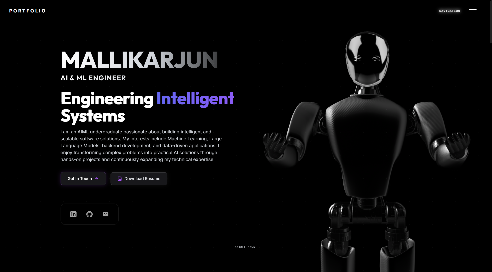
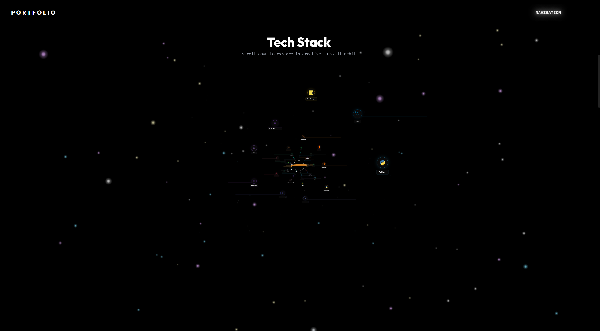
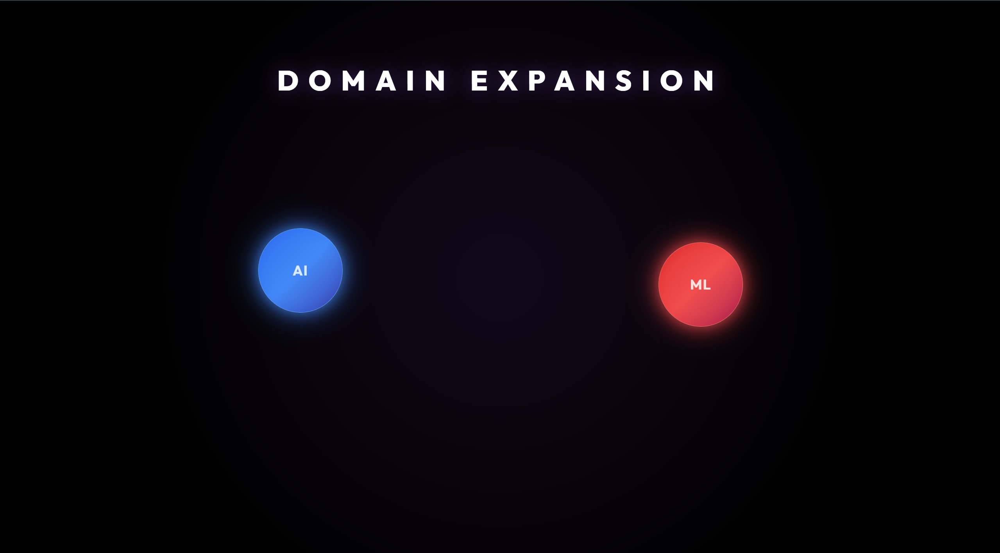
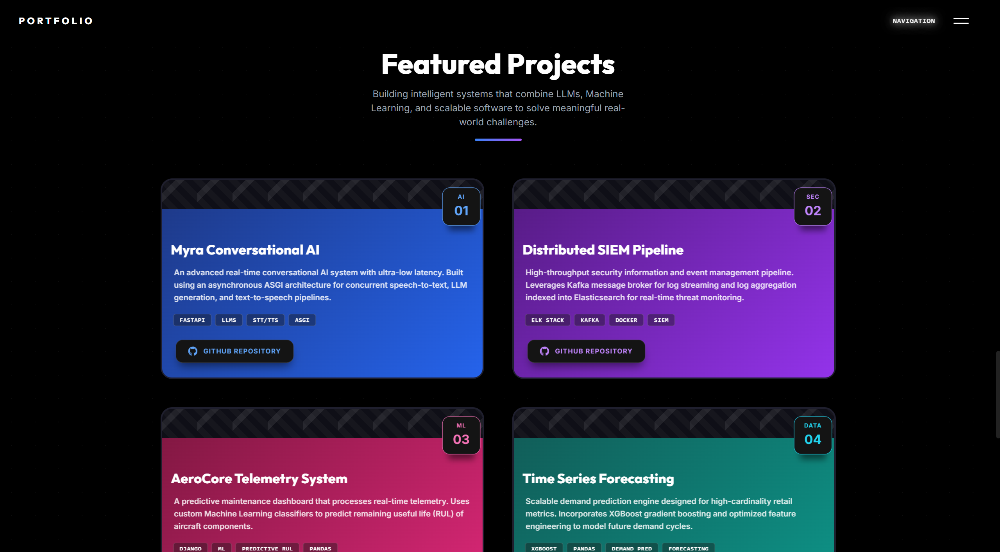
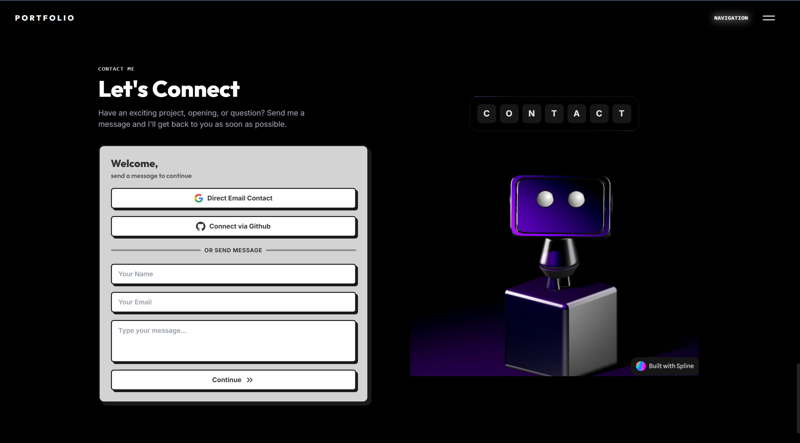
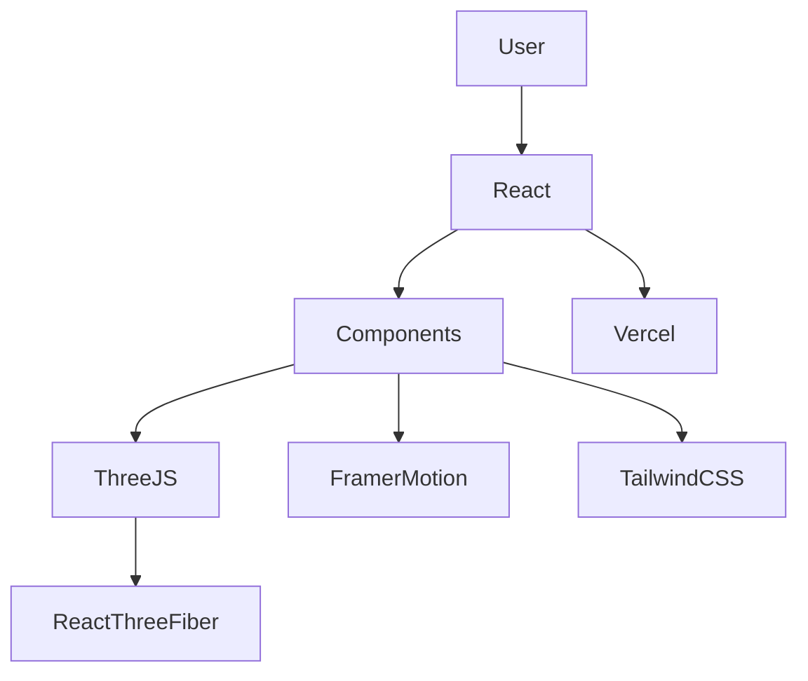

# 🚀 Mallikarjun -- AI & ML Engineer \| 3D Interactive Portfolio

> **Building intelligent AI solutions and immersive web experiences.**

A modern, high-performance 3D developer portfolio built with **React**,
**Three.js**, **React Three Fiber**, **Spline**, **Framer Motion**, and
**Tailwind CSS** to showcase my AI/ML projects, technical skills,
certifications, and professional journey through an interactive WebGL
experience.

------------------------------------------------------------------------

```{=html}
<p align="center">
```
[](https://mallugze.vercel.app)


```{=html}
</p>
```
# 📸 Portfolio Preview

## 🏠 Hero Section



## 🌌 Tech Stack Visualization



## ✨ Domain Animation



## 📦 Featured Projects



## ✉️ Contact Section



------------------------------------------------------------------------

# 💡 About the Portfolio

This portfolio was designed to go beyond a traditional developer
website. It combines modern frontend technologies with immersive 3D
graphics to create an engaging experience while highlighting my work in
Artificial Intelligence, Machine Learning, Full-Stack Development, and
Data Science.

The primary goal was to build a portfolio that feels like an application
rather than a static webpage while maintaining excellent responsiveness
and performance.

------------------------------------------------------------------------

# ✨ Key Features

-   🤖 Interactive 3D Spline Robot
-   🌌 React Three Fiber Skill Visualization
-   🎴 Interactive Project Showcase
-   ⚡ Smooth Framer Motion & GSAP Animations
-   📄 Animated Resume Download Button
-   ✉️ Modern Contact Form
-   🔗 Interactive Social Links
-   📱 Fully Responsive Design

------------------------------------------------------------------------

# 🏗️ Architecture



# 🛠️ Tech Stack

**Frontend:** React, Vite, JavaScript, HTML5, CSS3

**3D Graphics:** Three.js, React Three Fiber, Drei, Spline

**Animations:** Framer Motion, GSAP

**Styling:** Tailwind CSS, Glassmorphism

**Deployment:** Vercel


------------------------------------------------------------------------

# 💻 Local Development

``` bash
git clone https://github.com/mallugze/Portfolio.git

cd Portfolio

npm install

npm run dev
```

------------------------------------------------------------------------

# 📂 Project Structure

``` text
mallu_portfolio/
├── public/
│   ├── favicon.svg
│   ├── hero_ai_graphic.png
│   └── resume.pdf
├── screenshots/
│   ├── home_page.png
│   ├── tech_stack.png
│   ├── domain_animation.png
│   ├── projects.png
│   └── contact.png
├── src/
│   ├── components/
│   │   ├── Navbar.jsx
│   │   ├── Hero.jsx
│   │   ├── Projects.jsx
│   │   ├── Contact.jsx
│   │   ├── SkillsTesseract.jsx
│   │   ├── HollowPurpleIntro.jsx
│   │   └── ui/
│   │       ├── Pattern3DCard.jsx
│   │       ├── SocialFlipButton.jsx
│   │       ├── CreepyButton.jsx
│   │       ├── glass-dock.tsx
│   │       ├── splite.tsx
│   │       └── interactive-3d-robot.tsx
│   ├── App.jsx
│   ├── index.css
│   └── main.jsx
├── package.json
├── vite.config.js
└── README.md
```

------------------------------------------------------------------------

# 🌐 Live Demo

**https://mallugze.vercel.app**

------------------------------------------------------------------------

# 👨‍💻 Developed By

## Mallikarjun

AI & Machine Learning Engineer

📧 mallikarjunpx@gmail.com

💼 https://www.linkedin.com/in/mallikarjun-842509326

🌐 https://mallugze.vercel.app

------------------------------------------------------------------------

# ⭐ If you like this project, consider giving it a Star!
