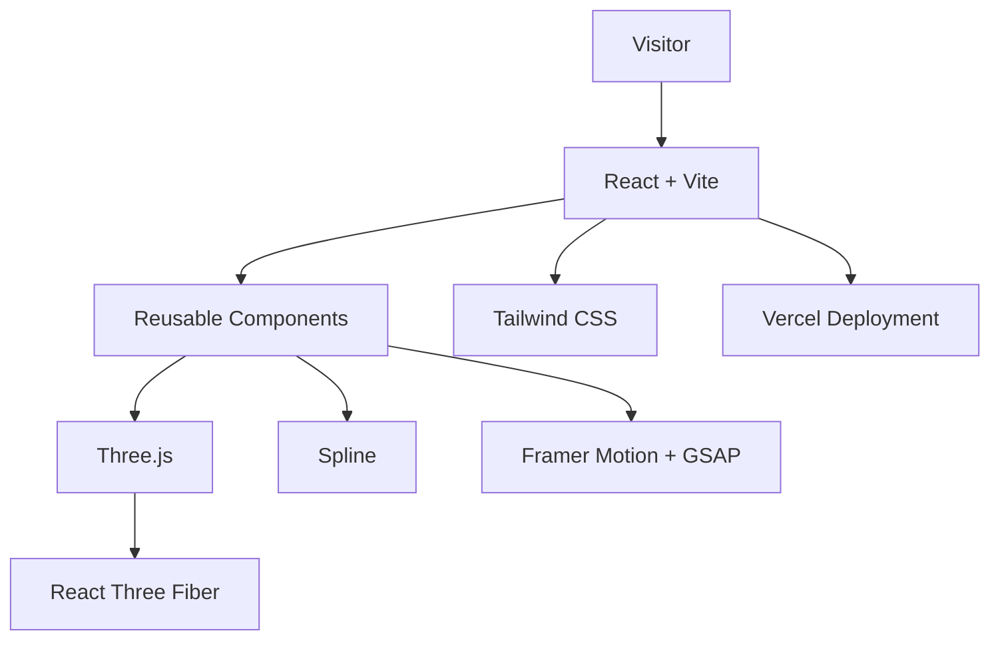

# 🚀 Mallikarjun \| AI & ML Engineer --- 3D Interactive Portfolio

> **Building intelligent AI solutions and immersive web experiences.**

A modern **3D developer portfolio** crafted with **React, Three.js,
React Three Fiber, Spline, Framer Motion, GSAP, and Tailwind CSS** to
showcase my projects, technical skills, and professional journey through
an immersive WebGL experience.

------------------------------------------------------------------------


<p align="center">

`<a href="https://mallugze.vercel.app">`{=html}``{=html}`</a>`{=html}
``{=html}
``{=html}
``{=html}
``{=html}
``{=html}
``{=html}
``{=html}
``{=html}


</p>


------------------------------------------------------------------------

# 📸 Portfolio Preview

## 🏠 Hero Section


## 🌌 Tech Stack Visualization


## ✨ Domain Animation


## 📦 Featured Projects


## ✉️ Contact Section


------------------------------------------------------------------------

# 💡 Why This Portfolio?

Rather than creating a traditional static portfolio, I wanted to build
an experience that reflects both my passion for **Artificial
Intelligence** and **modern frontend engineering**.

The result is a highly interactive WebGL-powered portfolio that blends
smooth animations, immersive 3D visuals, and responsive design while
maintaining excellent performance across devices.

------------------------------------------------------------------------

# ✨ Highlights

-   🤖 Interactive 3D Spline Robot
-   🌌 Animated React Three Fiber Skill Visualization
-   🎴 Interactive Project Showcase Cards
-   ⚡ Framer Motion & GSAP Animations
-   📄 Animated Resume Download Button
-   ✉️ Modern Contact Form
-   🔗 Interactive Social Links
-   📱 Fully Responsive Design
-   🚀 Optimized Performance

------------------------------------------------------------------------

# 🏗️ Architecture



------------------------------------------------------------------------

# 🛠️ Tech Stack

**Frontend:** React, Vite, JavaScript, HTML5, CSS3

**3D & WebGL:** Three.js, React Three Fiber, Drei, Spline

**Animations:** Framer Motion, GSAP

**Styling:** Tailwind CSS, Glassmorphism, CSS3

**Deployment:** Vercel

------------------------------------------------------------------------

# ⚡ Performance

-   Lazy-loaded assets
-   Optimized WebGL rendering
-   Responsive canvas scaling
-   Smooth animations
-   Fast Vite builds
-   Mobile-first layout

------------------------------------------------------------------------

# 💻 Local Development

``` bash
git clone https://github.com/mallugze/Portfolio.git

cd Portfolio

npm install

npm run dev
```

------------------------------------------------------------------------

# 📂 Project Structure

``` text
mallu_portfolio/
├── public/
│   ├── favicon.svg
│   ├── hero_ai_graphic.png
│   └── resume.pdf
├── screenshots/
│   ├── home_page.png
│   ├── tech_stack.png
│   ├── domain_animation.png
│   ├── projects.png
│   └── contact.png
├── src/
│   ├── components/
│   ├── assets/
│   ├── App.jsx
│   ├── main.jsx
│   └── index.css
├── package.json
├── vite.config.js
└── README.md
```

------------------------------------------------------------------------

# 🚀 Future Roadmap

-   🌙 Dark / Light Theme
-   🤖 AI Assistant
-   📝 Blog Section
-   📊 Visitor Analytics
-   🌍 Multi-language Support
-   📁 More Featured Projects

------------------------------------------------------------------------

# 🌐 Live Website

### https://mallugze.vercel.app

------------------------------------------------------------------------

# 👨‍💻 Developed By

**Mallikarjun**

AI & Machine Learning Engineer

📧 mallikarjunpx@gmail.com

💼 https://www.linkedin.com/in/mallikarjun-842509326

🌐 https://mallugze.vercel.app

------------------------------------------------------------------------

::: {align="center"}
### ⭐ If you like this project, consider giving it a Star!

Built with ❤️ using **React**, **Three.js**, **React Three Fiber**,
**Spline**, **Framer Motion**, and **Tailwind CSS**.
:::
